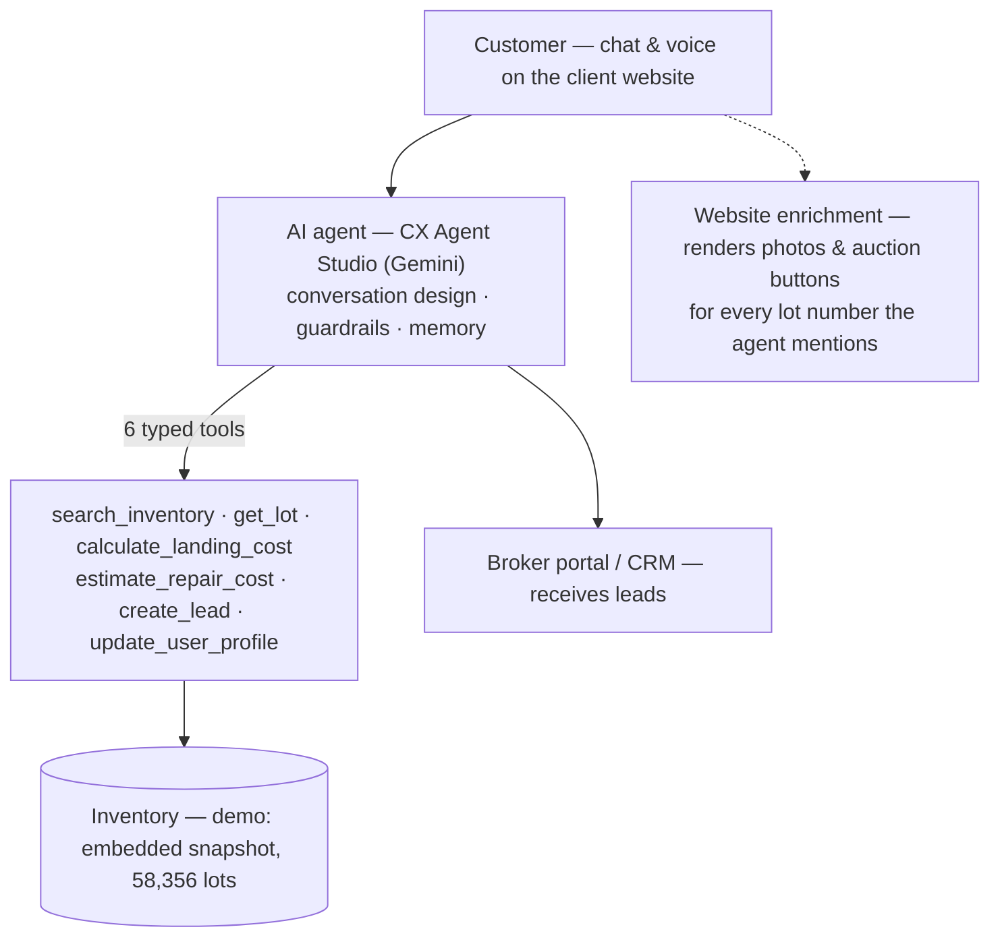

# GECX AI Auto Broker — Project Overview

**Working demo · July 2026 · Live at** `https://nika-tukhashvili.github.io/gecx-auto-broker/`
Companion documents: *GECX AI Support Agent — Architecture and Integration Options* (general patterns) · [Partner Integration Guide](INTEGRATION.md) (full API/data contract).

## Executive summary

A conversational agent that helps customers **import cars from US auctions (Copart/IAAI) to their home market**. Over chat and voice it searches real auction inventory, shows cars with photos and auction links, produces itemized to-the-door cost estimates for the configured destination port, estimates repair costs — including genuine visual analysis of customer-uploaded damage photos — and hands qualified leads to human brokers. **The agent never places bids and never handles payments**; a certified broker completes every transaction.

Built on Google **CX Agent Studio** (Gemini, natively multimodal). The demo runs a fictional brand (AUTOBROKER.AI) with **58,356 real auction lots**, a public website with embedded chat, a landed-cost calculator page, and a broker lead portal. Brand, languages, fees, destination port, and customs formulas are configuration rather than code — the demo is configured for one example corridor (US → Georgia), and the same platform can be configured for other markets (e.g. a Spanish importer: Valencia/Algeciras port, EU duty + VAT).

## 1. What the agent does

**1.1 Inventory search.** The customer describes what they want in natural language ("Toyota Corolla hybrid, 2021 or newer, under $20k, light damage okay"); the agent converts this to structured filters and searches all 58,356 lots. Numeric constraints are exact — a $15,000 budget never returns a $16,000 car — and the agent quotes true match counts. Criteria are remembered and updated mid-conversation without re-asking.

**1.2 Presenting cars.** Results appear with photos and a "view all photos & live bid" button under each message. The agent tracks "the current car" across turns — "tell me more", "that one", "the red one" resolve without repeating lot numbers. It answers general automotive questions (typical reliability, fuel economy, common issues) from model knowledge, clearly labeled as general information.

**1.3 Landed-cost estimate.** An itemized to-the-door breakdown: auction fees, inland US towing (region inferred from the yard's state), ocean freight to the destination port, broker service fee, and import duties/taxes computed from the client's customs formulas — in the demo, engine-size/age/fuel-based excise for the example corridor; for an EU market such as Spain, customs duty + VAT — using sensible defaults instead of interrogating the customer. Every figure is labeled an estimate that a human broker confirms before any bid.

**1.4 Repair estimates & photo inspection.** From a listing's stated damage the agent gives an honest wide range ("severity unconfirmed — no photo"). When the customer uploads a photo, the agent genuinely analyzes it — damaged areas, severity, shattered glass, deployed airbags, likely structural damage — and prices each line using make-based parts tiers (a Porsche panel is not priced like a Corolla panel). Always a range, always with the human-inspector disclaimer.

**1.5 Lead capture.** When the customer wants to proceed, the agent collects name and phone (used verbatim — names are never "corrected"), creates the lead, and reads back a short speakable reference (`LD-483920`). The lead appears in the broker portal tied to the exact car the customer chose — photo, lot number, and auction link included — with a 15-minute callback promise.

**1.6 Channels & languages.** Text chat is fully functional and multilingual (the demo ships two languages; adding a market's language is configuration). Voice conversation works end-to-end for dialogue; see §5 for a current platform limitation on voice tool execution.

## 2. Guardrails and trust

| Topic | How the agent behaves |
|---|---|
| Transactions | Never bids and never takes payments — a certified human broker completes every deal |
| Accuracy | Every vehicle detail, price, and reference number comes directly from inventory and business-system data |
| Incomplete data | If a listing doesn't state something (e.g. color), the agent says so and points the customer to the photos or a quick photo check — it doesn't speculate |
| Customer data | Only a name and phone number are collected; transcripts are automatically redacted; payment and ID data are never requested |
| Security | Resistant to prompt-injection attempts; internal configuration is never disclosed |
| Scope | Politely declines unrelated requests and returns the conversation to vehicle import |

## 3. How it works

- **Agent:** one root agent on CX Agent Studio with carefully engineered instructions (grounded answers, conversation memory, consistent references) plus safety guardrails and automatic transcript redaction; changes ship as versioned deployments.
- **Tools:** typed Python functions with strict contracts; the demo embeds the inventory snapshot inside the search tools (a deliberate demo simplification — see §5).
- **Media rendering:** the agent's replies contain no raw URLs (important for a clean voice experience); the website recognizes lot numbers in the conversation and renders each car's photo strip and auction button directly from inventory data — so visuals stay consistent across the chat, the website, and the broker portal.
- **Broker portal:** demo-grade dashboard showing captured leads with car, photo, budget, and status.
- **Data pipeline (demo):** a resumable scraper produces the inventory snapshot (58k lots with photos, damage, titles, locations, prices).

## 4. What it needs in a real environment

The demo is self-contained; a production deployment replaces its snapshot-and-static-site plumbing with the client's systems. This maps directly to the integration options in the general architecture document; the full contract lives in the [Partner Integration Guide](INTEGRATION.md).

**4.1 Inventory access — one of:**
- **Partner-hosted APIs** (client keeps the data): structured search with exact filters + lot detail + a facet dictionary (their damage/title enumerations), latency p95 ≤ 1s, and media URLs without bot-walls (photos must load in chat and be fetchable for AI analysis). Optional: semantic/vector search — with numeric constraints kept as hard filters.
- **Client-provided data feed** (we host): bulk export + ongoing sync (webhooks or delta feed with tombstones), freshness ≤ 15 min for live-auction prices, documented enumerations, image licensing.

**4.2 Lead delivery — one of:** the client's CRM endpoint (idempotent, with a no-silent-loss retry guarantee), a standard CRM connector (HubSpot/Salesforce/Bitrix24), or our hosted broker portal.

**4.3 Production runtime.** The demo runs on managed CX Agent Studio; for production we recommend the agent as an **ADK service (Cloud Run / Agent Engine)** behind the same tool contracts — enabling live database queries at any scale, model selection, response verification (every lot number checked against the database before it reaches the customer), server-side photo analysis of listing images, and fully working voice tool-calling. This is the "dedicated integration service" pattern from the general architecture document.

**4.4 Per-deployment configuration.** Brand and greeting, destination market — port, customs/duty formulas and currency (supplied by the client's local brokerage, signed off on worked examples; e.g. Georgia excise vs. Spanish EU duty + VAT), service fees, callback SLA, languages, lead destination, enabled features.

## 5. Current demo status and known limitations

| Demo aspect | Limitation | Production remedy |
|---|---|---|
| Inventory snapshot | Static scrape; prices indicative, no live status | Live feed/API (§4.1) |
| Embedded tool data | Practical ceiling ~60k cars; frozen between updates | Live database queries (§4.3) |
| Voice channel | Platform issue: the managed voice channel does not execute tools, so voice demos conversation, not live search | Owned runtime with working voice function-calling (§4.3) |
| Photos | Hotlinked from the source's CDN; can be blocked for some visitors | Client media URLs or mirrored images with license (§4.1) |
| Broker portal leads | Stored per-browser (demo) | Real CRM delivery (§4.2) |
| Agent seeing listing photos | Only customer-uploaded photos are analyzed | Server-side fetch + analysis of listing images (§4.3) |

None of these affect the demo's purpose: the conversation quality, honesty behavior, estimates, photo inspection, and lead flow are the product; the plumbing swaps per client.

## Links

- Live demo: `https://nika-tukhashvili.github.io/gecx-auto-broker/` (Inventory · Cost Calculator · Broker Portal)
- Partner Integration Guide: [docs/INTEGRATION.md](INTEGRATION.md)
- General architecture: *GECX AI Support Agent — Architecture and Integration Options*
- Repository: `github.com/Nika-Tukhashvili/gecx-auto-broker`
